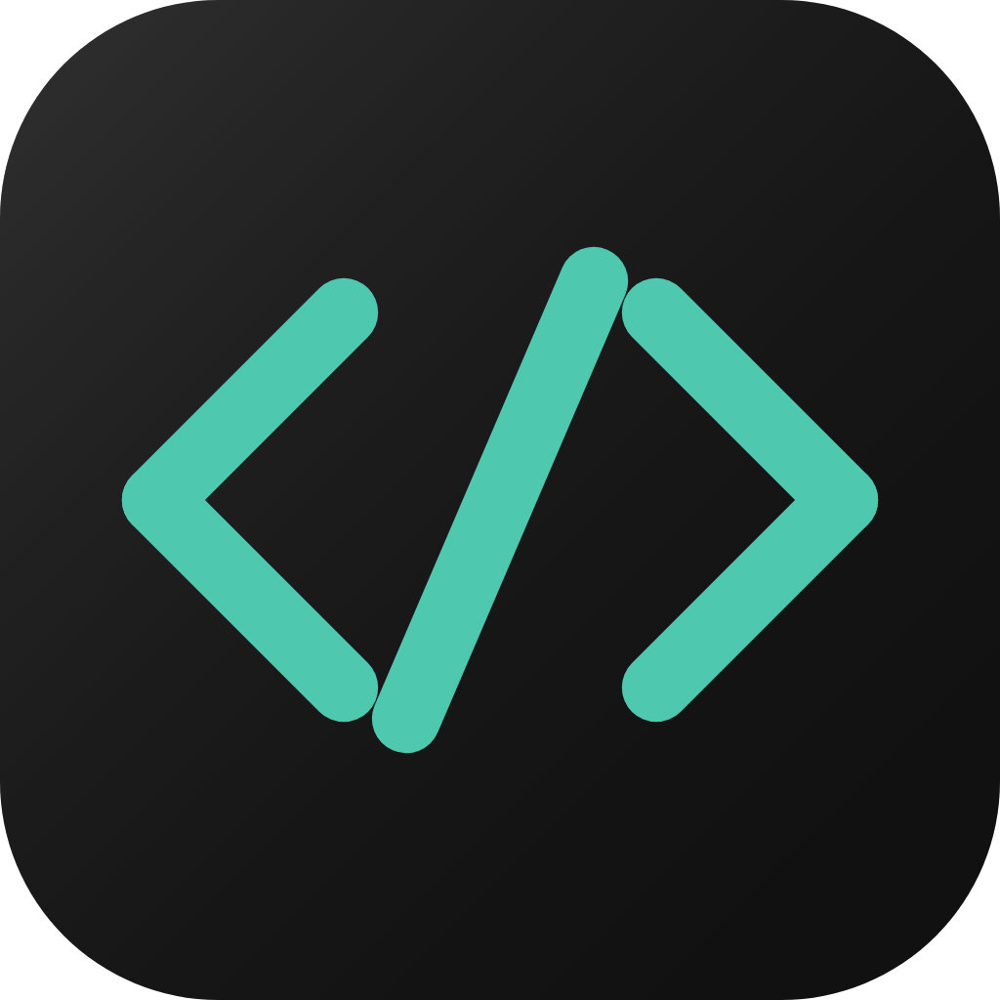

<p align="center">
  
</p>
<h1 align="center">Code Bench</h1>

Desktop AI coding assistant for local repositories. Bring your own model — Anthropic, OpenAI, Gemini, and Ollama work out of the box, or point it at any OpenAI-compatible custom endpoint. Chat over your repo, run your tools, edit files in place, and watch git state update inline.

[](LICENSE)
[](https://github.com/mkappworks-dev/code-bench-app/releases/latest)
[](https://github.com/mkappworks-dev/code-bench-app#platforms)

## Installation (macOS)

1. Download `CodeBench-macos.dmg` from the [latest release](https://github.com/mkappworks-dev/code-bench-app/releases/latest).
2. Open the DMG and drag **Code Bench** into **Applications**.
3. Launch the app from Applications.

> When you point Code Bench at a project under Documents, Downloads, or Desktop, macOS will ask _"Code Bench would like to access files in your … folder."_ Click **Allow**. Code Bench reads project files from wherever you store them on disk, so it needs access to those user folders.

## Features

The app is chat-centric: a single conversation surface with a project sidebar on the left, an inline changes panel that surfaces the agent's edits as they happen, and a top action bar for the active project's branch and PR state. Settings (`⌘,`) hosts the configuration sub-areas.

| Surface              | Capabilities                                                                                                                                                   |
| -------------------- | -------------------------------------------------------------------------------------------------------------------------------------------------------------- |
| **Chat**             | Streaming responses · per-session system prompt · model selector · agent loop with tool use · interactive permission prompts · "ask the user a question" cards |
| **Project sidebar**  | Add/relocate local projects · session list per project · session archive · live git state (branch, ahead/behind, dirty-tree) · branch picker                   |
| **Changes panel**    | Inline diff per edited file · per-change accept/reject · conflict-merge view when on-disk drifts from agent edits · commit dialog · create-PR dialog           |
| **Coding tools**     | Built-in tool registry (filesystem read/write, ripgrep, bash, web fetch) · per-tool denylist · ripgrep auto-detect · ready for MCP-server tool sources         |
| **MCP servers**      | Configure stdio and HTTP/SSE MCP servers · enable/disable per server · tool inventory surfaces in chat                                                         |
| **Integrations**     | GitHub OAuth or PAT sign-in · repository browser feeding the project sidebar                                                                                   |
| **Providers**        | Multi-provider key storage (OpenAI · Anthropic · Gemini · Ollama · custom OpenAI-compatible endpoint) · per-provider connectivity test · keys in OS keychain   |
| **Settings → Reset** | "Wipe all data" — clears API keys, GitHub sign-in, chat history, projects, and MCP servers in one step                                                         |
| **Auto-update**      | Checks the GitHub Releases endpoint on launch and from Settings · verifies Team-ID match and `codesign`/`spctl` on macOS · self-installs and relaunches        |

## Platforms

| Platform | Status                                                                                                                                                                                                                |
| -------- | --------------------------------------------------------------------------------------------------------------------------------------------------------------------------------------------------------------------- |
| macOS    | ✅ Supported — built, signed, notarized, and released in CI on every tag                                                                                                                                              |
| Windows  | ⚠️ Unsupported — Flutter build target exists, but no CI, no signing, no released binaries. Use at your own risk and expect to fix things.                                                                             |
| Linux    | ⚠️ Unsupported — same caveats as Windows. Both matrix entries are commented out in [`.github/workflows/build.yml`](.github/workflows/build.yml) and [`.github/workflows/release.yml`](.github/workflows/release.yml). |

iOS, Android, and Web are out of scope.

> If you want Windows or Linux to be a supported platform, the path is: re-enable the matrix entries in [`build.yml`](.github/workflows/build.yml) and [`release.yml`](.github/workflows/release.yml), add platform-appropriate code-signing, fix anything that breaks, and update this section. Until that happens, treat the desktop builds for those targets as a developer-only escape hatch.

## Requirements

| Dependency                           | Version                                |
| ------------------------------------ | -------------------------------------- |
| Flutter SDK                          | ≥ 3.41.6 stable                        |
| Dart SDK                             | ≥ 3.11.4                               |
| Xcode (macOS builds)                 | 15+ Sequoia (Xcode CLI tools required) |
| Windows 10 (Windows builds)          | 1903+ _(in development)_               |
| GTK 3 + ninja + cmake (Linux builds) | system packages _(in development)_     |

### 1. Clone and fetch packages

```bash
git clone git@github.com:mkappworks-dev/code-bench-app.git
cd code-bench-app
flutter pub get
```

### 2. Generate code

Drift (SQLite ORM) and Riverpod require a one-time code-generation step. Run this before the first build and whenever you modify database tables or add `@riverpod` providers:

```bash
dart run build_runner build --delete-conflicting-outputs
```

Use watch mode during active development:

```bash
dart run build_runner watch --delete-conflicting-outputs
```

### 3. Run

For macos:

```bash
flutter run -d macos      # primary dev target
```

For windows:

```bash
flutter run -d windows
```

For linux:

```bash
flutter run -d linux
```

On first launch, the onboarding screen gates access until at least one AI provider API key is saved.

> **GitHub OAuth** — replace `YOUR_GITHUB_CLIENT_ID` in [lib/data/github/datasource/github_auth_datasource_web_dio.dart](lib/data/github/datasource/github_auth_datasource_web_dio.dart) with a real GitHub OAuth App client ID. Create one at **Settings → Developer settings → OAuth Apps** with the callback URL configured in `AppConstants.oauthCallbackUrl`. (PAT sign-in is also supported and does not require an OAuth app.)

## Project Structure

```
lib/
├── main.dart                    # Entry point — ProviderScope, window_manager init
├── app.dart                     # MaterialApp.router wired to GoRouter
├── router/
│   └── app_router.dart          # GoRouter: onboarding guard + chat ShellRoute + settings route
├── shell/
│   ├── chat_shell.dart          # Sidebar + chat column + optional changes panel; ⌘N / ⌘, shortcuts
│   ├── notifiers/               # Top-action-bar and status-bar state
│   └── widgets/                 # AppLifecycleObserver, TopActionBar, StatusBar, ActionOutputPanel
├── core/                        # Constants, AppException hierarchy, theme/colors, utils, shared widgets
├── data/
│   ├── _core/                   # Drift AppDatabase, DioFactory, SecureStorage, preferences
│   ├── shared/                  # Cross-cutting models: AIModel, ChatMessage
│   ├── ai/                      # AI datasources (Dio), repository, models/
│   ├── session/                 # Session datasource (Drift), repository, models/ (ChatSession, ToolEvent, …)
│   ├── project/                 # Project datasource (Drift), repository, models/ (Project, WorkspaceProject, …)
│   ├── git/                     # Git datasource (Process), live-state datasource, repository, models/, exceptions
│   ├── github/                  # GitHub datasources (Dio + OAuth), repository, models/
│   ├── apply/                   # Apply datasource (filesystem), repository, security guard
│   ├── filesystem/              # Filesystem datasource (dart:io)
│   ├── bash/                    # Bash datasource (Process) — the one documented `runInShell` exception
│   ├── coding_tools/            # Tool inputs/outputs, denylist, registry-facing types
│   ├── mcp/                     # MCP config datasource (Drift), transport datasources (stdio + HTTP/SSE), repository, models/
│   ├── web_fetch/               # Web-fetch datasource (Dio)
│   ├── providers/               # Provider catalog + ProvidersService backing
│   ├── settings/                # Settings datasource (Drift + SharedPreferences), repository, models/
│   ├── update/                  # Update datasources (Dio for releases, Process for install, IO for sentinel), models/
│   └── integrations/            # Integration metadata (GitHub OAuth/PAT)
├── services/
│   ├── ai/                      # AIService — stream buffering, model resolution
│   ├── agent/                   # Agent loop — tool dispatch, permission prompts, iteration cap
│   ├── coding_tools/            # ToolRegistry, denylist service, ripgrep availability probe, individual tools/
│   ├── mcp/                     # MCP service — server lifecycle, tool inventory
│   ├── git/                     # GitService — composite git operations
│   ├── github/                  # GitHubService — OAuth + REST composition
│   ├── session/                 # SessionService — send-and-stream, history, archive
│   ├── project/                 # ProjectService — add/relocate, scan
│   ├── apply/                   # ApplyService — patch orchestration + security guard
│   ├── providers/               # ProvidersService — keychain-backed key storage
│   ├── api_key_test/            # ApiKeyTestService — provider connectivity checks
│   ├── ide/                     # IdeService — editor/terminal launch
│   ├── settings/                # SettingsService — wipe cascade, onboarding
│   └── update/                  # UpdateService — version comparison, codesign/spctl gates, swap-and-relaunch
└── features/
    ├── onboarding/              # First-run wizard (API keys, GitHub sign-in)
    ├── chat/                    # Chat UI, message streaming, agent permission prompts, code-apply actions
    ├── project_sidebar/         # Project list, session list, archive, branch picker triggers
    ├── branch_picker/           # Branch picker dialog + notifier
    ├── archive/                 # Archived sessions screen
    ├── general/                 # Settings → General (preferences, update section, reset section)
    ├── providers/               # Settings → Providers (per-provider keys + test)
    ├── integrations/            # Settings → Integrations (GitHub sign-in)
    ├── coding_tools/            # Settings → Coding Tools (denylist, ripgrep status)
    ├── mcp_servers/             # Settings → MCP Servers (configure, enable/disable)
    ├── update/                  # Update notifier, state, failure types, "Check now" UI
    └── settings/                # Settings shell + sub-area router
```

## Architecture

### Dependency rule

The dependency graph is strictly one-directional. Violating it is a build-review blocker:

```
Widgets / Screens
      ↓  (ref.watch / ref.read notifier)
  Notifiers          ← the only layer widgets may reach
      ↓  (ref.read service)
  Services           ← business logic, composition, typed exceptions
      ↓  (constructor injection)
  Repositories       ← domain interfaces; no I/O
      ↓
  Datasources        ← Dio, DB, Process.run, filesystem live here
      ↓
External (REST APIs / SQLite / OS)
```

Widgets communicate with notifiers only via `ref.watch` / `ref.read(…notifier).method()`. They never reach into a service or repository provider directly. `Process.run`, `dart:io`, and `Dio` are confined to `lib/data/**/datasource/`.

**Command notifiers** (`*Actions`, e.g. `ProjectSidebarActions`, `CodeApplyActions`, `GitActions`) use `void build()` with `keepAlive: true` and expose imperative `Future<void>` methods. They are the bridge between the UI and the service layer.

**Naming conventions:**

| Layer                      | Rule                                                                                         |
| -------------------------- | -------------------------------------------------------------------------------------------- |
| Service class              | ends in `Service` (`GitService`, `SessionService`)                                           |
| Service provider           | `@riverpod` function placed before the class it instantiates                                 |
| Repository interface       | ends in `Repository` (`GitRepository`, `AIRepository`)                                       |
| Repository impl + provider | class ends in `RepositoryImpl`; `@riverpod` before it                                        |
| Datasource file naming     | suffix encodes I/O type: `*_dio.dart`, `*_process.dart`, `*_io.dart`, `*_drift.dart`         |
| Command notifier           | ends in `Actions`; `void build()`, `keepAlive: true`                                         |
| State notifier             | ends in `Notifier`; owns `AsyncValue` or value state                                         |
| Notifier file placement    | `*_notifier.dart`, `*_actions.dart`, and `*_failure.dart` all live in `{feature}/notifiers/` |

The Riverpod generator strips the `Notifier` suffix from provider names (`ActiveSessionIdNotifier` → `activeSessionIdProvider`). The `Actions` suffix is kept (`GitActions` → `gitActionsProvider`). Widgets must never call `ref.invalidate` directly — route through a notifier method instead.

### Layered architecture

**Widgets** are pure state-renderers. They call notifier methods and listen for `AsyncError` state to show snackbars — they never try/catch business-logic calls or import service/repository exception types.

**Notifiers** mediate all commands. `*Actions` notifiers extend `AsyncNotifier<void>`; failures are emitted as `AsyncError` carrying a typed `sealed class {Notifier}Failure`. `*Notifier` classes own reactive `AsyncValue<T>` data state.

**Services** own business logic and composition. They receive repositories via constructor injection, convert low-level I/O errors into typed domain exceptions, and expose a clean API to notifiers. Services are instantiated via `@riverpod` / `@Riverpod(keepAlive: true)` providers and never constructed directly.

**Repositories** are domain interfaces (`lib/data/**/repository/`). Implementations (`*RepositoryImpl`) are wired up via Riverpod providers and injected into services.

**Datasources** (`lib/data/**/datasource/`) are where all I/O lives: Dio HTTP calls, SQLite via Drift, `Process.run`, and `dart:io` filesystem access. File suffix encodes the I/O type: `*_dio.dart`, `*_process.dart`, `*_io.dart`, `*_drift.dart`.

The full rules — naming conventions, error-handling patterns, logging matrix, security guards — are in [`CLAUDE.md`](CLAUDE.md).

### State management

| Pattern                                     | Used for                                                                                                                                                                     |
| ------------------------------------------- | ---------------------------------------------------------------------------------------------------------------------------------------------------------------------------- |
| `@Riverpod(keepAlive: true)` class Notifier | Long-lived app state: active session ID, active project ID, selected model, system prompts, DB, storage                                                                      |
| `@Riverpod(keepAlive: true)` class Actions  | Imperative commands: `*Actions` notifiers expose `Future<void>` methods that mediate widget → service calls (e.g. `CodeApplyActions`, `ProjectSidebarActions`, `GitActions`) |
| `@riverpod` class AsyncNotifier             | Chat messages (loads history, streams new messages)                                                                                                                          |
| `@riverpod` function (StreamProvider)       | Session list, live git state, MCP server list — wraps Drift / Process stream sources                                                                                         |
| `@riverpod` function (FutureProvider)       | One-shot reads: available model list, package version, last update-check timestamp                                                                                           |

### Local persistence

All data is stored in a local SQLite database managed by Drift (`code_bench.db`).

| Table               | Stores                                                                                                   |
| ------------------- | -------------------------------------------------------------------------------------------------------- |
| `ChatSessions`      | Session ID · title · model/provider · created/updated timestamps · pin flag · archive flag               |
| `ChatMessages`      | Message ID · session FK · role · content · extracted code blocks (JSON) · tool events (JSON) · timestamp |
| `WorkspaceProjects` | Project ID · name · local path · linked repo ID · active branch · associated session IDs                 |
| `McpServers`        | Server ID · name · transport (stdio / HTTP-SSE) · command + args · env (JSON) · URL · enabled flag       |

DAOs: `SessionDao` (sessions + messages CRUD, stream watch) · `ProjectDao` (projects CRUD) · `McpDao` (servers CRUD, including `deleteAll` for the wipe cascade).

### Secret storage

`SecureStorageSource` wraps `flutter_secure_storage` using a consistent key scheme:

| Key                       | Holds                                           |
| ------------------------- | ----------------------------------------------- |
| `api_key_{provider}`      | API key per AI provider (e.g. `api_key_openai`) |
| `github_token`            | GitHub OAuth access token                       |
| `ollama_base_url`         | Custom Ollama server URL                        |
| `custom_endpoint_url`     | OpenAI-compatible custom endpoint               |
| `custom_endpoint_api_key` | Key for the custom endpoint                     |

| Platform | Backend                                 |
| -------- | --------------------------------------- |
| macOS    | Keychain (`first_unlock` accessibility) |
| Windows  | Windows Credential Manager              |
| Linux    | libsecret                               |

## Building for Distribution

for macos:

```bash
flutter build macos --release   # → build/macos/Build/Products/Release/
```

> **macOS App Sandbox is intentionally disabled.** Code Bench shells out to
> `git`, `code`, `cursor`, and user-defined action commands, which cannot
> work under sandbox. See [macos/Runner/README.md](macos/Runner/README.md)
> for the rationale, contributor rules, and distribution implications
> (Mac App Store eligibility, hardened runtime, notarization).

for windows:

```bash
flutter build windows --release # → build/windows/x64/runner/Release/ (unsupported)
```

for linux:

```bash
flutter build linux --release   # → build/linux/x64/release/bundle/ (unsupported)
```

## Releasing (macOS)

Releases are managed by [release-please](https://github.com/googleapis/release-please). Every merge to `main` updates an open release PR that bumps `pubspec.yaml`, writes `CHANGELOG.md`, and proposes the next semver version based on conventional commit types (`feat:` → minor, `fix:` → patch, `feat!:` / `BREAKING CHANGE:` → major). Merging that PR creates a `v*` tag, which triggers [`.github/workflows/release.yml`](.github/workflows/release.yml) to build the macOS app, sign with a Developer ID, notarize through Apple's notary service, staple the ticket, and upload `CodeBench-macos.dmg` and `CodeBench-macos.zip` to the release. The in-app auto-updater consumes those artifacts on next launch of older clients.

### Required GitHub Actions secrets

Add these under **Settings → Secrets and variables → Actions** before the first release:

| Secret                       | Holds                                                        | How to get it                                                                                                                                |
| ---------------------------- | ------------------------------------------------------------ | -------------------------------------------------------------------------------------------------------------------------------------------- |
| `MACOS_CERTIFICATE`          | Base64-encoded Developer ID Application certificate (`.p12`) | Export from Keychain Access (right-click identity → Export → `.p12`), then `base64 -i cert.p12 \| pbcopy` and paste                          |
| `MACOS_CERTIFICATE_PASSWORD` | Password set when exporting the `.p12`                       | The password you typed at export time                                                                                                        |
| `MACOS_PROVISIONING_PROFILE` | Base64-encoded Developer ID provisioning profile             | See [macos/Runner/README.md](macos/Runner/README.md#macos_provisioning_profile-secret) for the full Developer Portal walkthrough             |
| `APPLE_ID`                   | Apple ID email of the notarizing account                     | The email tied to your Apple Developer membership                                                                                            |
| `APPLE_ID_PASSWORD`          | App-specific password — **not** your Apple ID password       | [appleid.apple.com](https://account.apple.com) → Sign-In and Security → App-Specific Passwords → Generate (label e.g. `code-bench-notarize`) |
| `APPLE_TEAM_ID`              | 10-character Team ID (also used as Xcode `DEVELOPMENT_TEAM`) | [developer.apple.com/account](https://developer.apple.com/account) → Membership Details                                                      |
| `RELEASE_PLEASE_TOKEN`       | Personal access token (classic) with `repo` scope            | [github.com/settings/tokens](https://github.com/settings/tokens) → Generate new token (classic) → check `repo` → no expiry                   |

> **Why a PAT for release-please?** PRs created by the default `GITHUB_TOKEN` are blocked from triggering other workflows (GitHub's anti-loop protection). Without a PAT, the release PR's required status checks (`Analyze & Test`, `Build (macos)`) get stuck on "Expected — Waiting for status to be reported" and never run. A PAT makes the PR appear as user-created so CI fires normally.

### Cutting a release

1. Merge feature/fix PRs to `main` as normal — use [Conventional Commits](https://www.conventionalcommits.org/) (`feat:`, `fix:`, etc.).
2. release-please keeps a release PR open that accumulates all pending commits.
3. When you're ready to ship, merge the release PR.
4. CI tags, builds, notarizes, and publishes automatically — no manual steps needed.

> **Never manually bump `pubspec.yaml` or push `v*` tags.** release-please owns both. Manual bumps or tags will confuse the manifest and produce duplicate or mis-versioned releases.

### Recovering a stuck release

If a tag exists on GitHub but `release.yml` never ran (the release page is missing the `CodeBench-macos.dmg` and `CodeBench-macos.zip`, only GitHub's auto-generated source archives are present), the tag was likely created by `GITHUB_TOKEN` and didn't trigger workflows. Re-run the build manually:

**Actions tab → Release → Run workflow → enter the tag (e.g. `v0.2.0`) → Run.**

This builds and signs from the tag, then uploads the artifacts into the existing release without overwriting the changelog.

## Testing & Linting

```bash
flutter test                         # run all tests
flutter analyze                      # static analysis
dart format lib/ test/               # format
dart format --set-exit-if-changed lib/ test/   # CI format check
```

## Extending Code Bench

### Adding an AI provider

1. Add a value to the `AIProvider` enum in [lib/data/shared/ai_model.dart](lib/data/shared/ai_model.dart).
2. Implement the streaming `sendMessage` path under `lib/data/ai/datasource/` (Dio for HTTP, `*_dio.dart` suffix) and surface it through `AIRepository` / `AIService` in [lib/services/ai/ai_service.dart](lib/services/ai/ai_service.dart).
3. Add the per-provider key plumbing in [lib/data/\_core/secure_storage.dart](lib/data/_core/secure_storage.dart) and the corresponding entry in `ProvidersService` ([lib/services/providers/providers_service.dart](lib/services/providers/providers_service.dart)).
4. Wire the connectivity test in [lib/services/api_key_test/](lib/services/api_key_test/).
5. Add the row to the Settings → Providers UI under [lib/features/providers/](lib/features/providers/).

### Adding a Drift table

1. Define the table class in [lib/data/\_core/app_database.dart](lib/data/_core/app_database.dart).
2. Create a `@DriftAccessor` DAO class in the same file (include a `deleteAll` method so the table participates in `SettingsService.wipeAllData`).
3. Add both to the `@DriftDatabase` annotation and the `daos` list.
4. Increment `schemaVersion` and add a `migration` step.
5. Run `dart run build_runner build --delete-conflicting-outputs`.
6. If the table holds user data, add a wipe step to [lib/services/settings/settings_service.dart](lib/services/settings/settings_service.dart) so "Wipe all data" stays exhaustive.

## Tech Stack

| Layer             | Technology                                                                              |
| ----------------- | --------------------------------------------------------------------------------------- |
| UI                | Flutter · Material Design · Google Fonts                                                |
| State             | flutter_riverpod · riverpod_annotation                                                  |
| Navigation        | go_router (ShellRoute)                                                                  |
| Local DB          | Drift (SQLite via sqlite3_flutter_libs)                                                 |
| Secret storage    | flutter_secure_storage                                                                  |
| HTTP / streaming  | Dio (SSE via `ResponseType.stream`)                                                     |
| AI providers      | OpenAI · Anthropic · Gemini · Ollama · Custom (OpenAI-compatible)                       |
| Tool sources      | Built-in registry (filesystem, ripgrep, bash, web fetch) · MCP (stdio + HTTP/SSE)       |
| Chat rendering    | flutter_markdown_plus · flutter_highlight                                               |
| GitHub OAuth      | flutter_web_auth_2                                                                      |
| Self-update       | GitHub Releases API · `codesign --verify` + `spctl --assess` · swap-and-relaunch helper |
| Preferences       | shared_preferences (NSUserDefaults / equivalents)                                       |
| Window management | window_manager                                                                          |
| Serialization     | freezed · json_annotation                                                               |
| Code generation   | build_runner · riverpod_generator · drift_dev · freezed · json_serializable             |

## Contributing

Contributions are welcome. Please read [CONTRIBUTING.md](CONTRIBUTING.md) before opening a PR.

## Security

To report a vulnerability, see [SECURITY.md](SECURITY.md).

## License

[MIT](LICENSE) — free to use, modify, and distribute.
